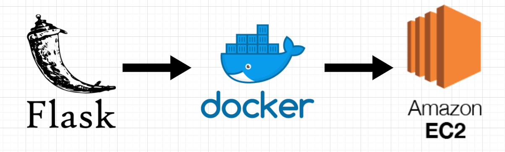
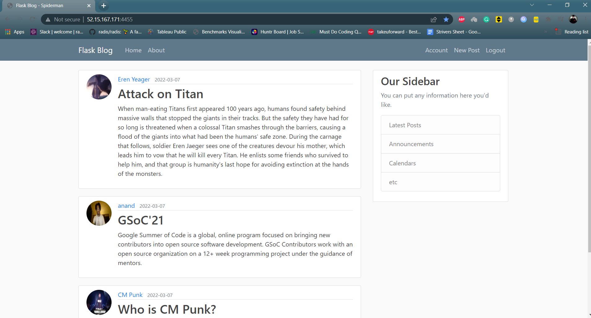

# Blogging App using Flask, Docker, and AWS EC2

  

Blogging WebApp developed using `Flask`, and `HTML/CSS` for frontend, containerized using `Docker` and hosted on `AWS EC2` instance.

Following is the link of application: [http://52.15.167.171:4455/](http://52.15.167.171:4455/)

## It is a blogging with the following functionality:
- Account creation and login authorization using `bcrypt` encryption for password matching. 
- A registered user can add blogs and can modify or delete them.
- Users can change his/her profile pic and a normal user (without login) can browse over any blog post.

  

## Installation

### For Development Version

- Press the Fork button, to save a copy of this repository on your GitHub account
- Clone this repository by typing `git clone https://github.com/<GITHUB-USERNAME>/Blog-Up-App.git` command in git bash
- Create a New branch using `git branch new-branch` and move into the new branch using `git checkout new-branch`
- Create a virtual environment using `conda`,`venv`, `pipenv`, etc and activate it. `Python = 3.7` recommended
- Install dependencies using `pip install -r requirements.txt`
- Before pushing code to repository makes sure to pull the latest remote repository by `git remote add upstream https://github.com/anandxkumar/Blog-Up-App.git` and `git pull upstream main`, and resolve any merge conflict if exists

### For Non-Development Version
- Clone this repository by typing git clone `https://github.com/anandxkumar/Blog-Up-App.git` command in git bash 
- Install dependencies using `pip install -r requirements.txt`

  OR

Download this repository by clicking on Download ZIP inside the Code button 

